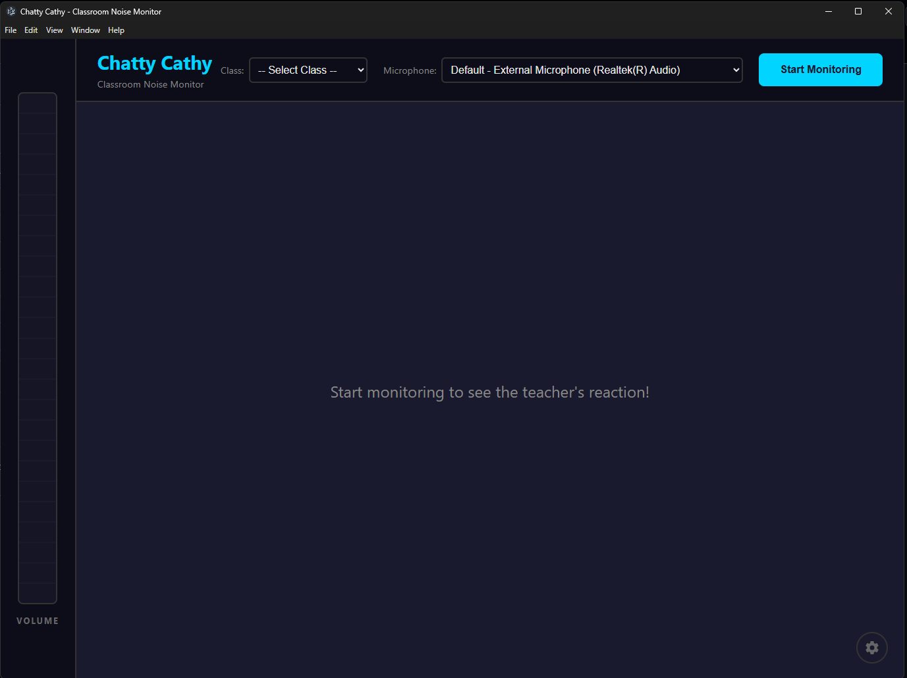
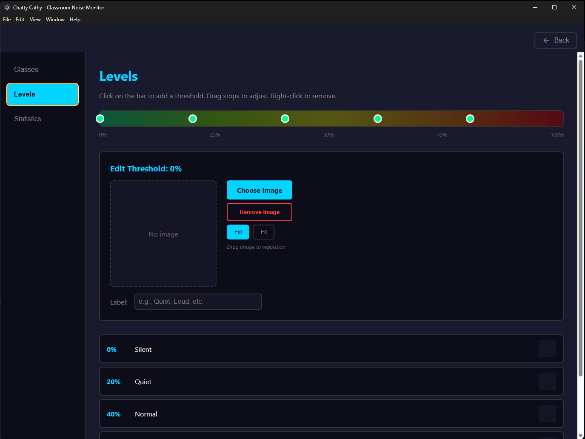
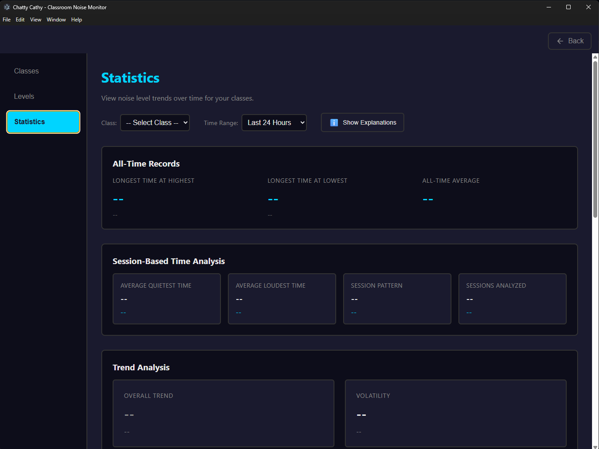

# Chatty Cathy

<div align="center">


**A fun, visual classroom noise monitor for teachers**

[](https://github.com/Mumblinmad/ChattyCathy/releases)
[](https://opensource.org/licenses/ISC)
[](https://www.electronjs.org/)
[](https://github.com/Mumblinmad/ChattyCathy/releases)

[Features](#features) • [Installation](#installation) • [Usage](USAGE.md) • [Screenshots](#screenshots) • [Contributing](#contributing)

</div>

---

## What is Chatty Cathy?

Chatty Cathy is a desktop application designed for **teachers and educators** who want a fun, visual way to monitor and manage classroom noise levels. Instead of constantly shushing students, let Chatty Cathy do the work with customizable images that change based on how loud the room gets!

Perfect for:
- Elementary school teachers
- Music and art classrooms
- Libraries and study halls
- Any environment where you want visual noise feedback

## Features

### Real-Time Noise Monitoring
- **Live volume meter** with color-coded gradient (green → yellow → red)
- **5-second rolling average** for stable, accurate readings
- **Microphone selection** - choose any connected audio input device

### Customizable Visual Feedback
- **Set custom images** for different noise levels (calm teacher, frustrated teacher, etc.)
- **Adjustable thresholds** - drag stops on a gradient bar to set your own noise boundaries
- **Image positioning** - drag to reposition and choose Fill/Fit modes for perfect cropping
- **Custom labels** - name each level ("Silent", "Working Volume", "Too Loud!")

### Class Management
- **Multiple classes** - track noise data separately for each class period
- **Persistent storage** - all data saved locally using SQLite

### Comprehensive Statistics
- **Interactive D3.js charts** showing noise patterns by time of day
- **Time-based analysis** - find your quietest and loudest times
- **Trend analysis** - see if noise levels are improving or worsening
- **Class comparison** - compare average noise levels across all your classes
- **Teacher Stress Score** - a fun metric based on daily noise exposure
- **Volatility tracking** - measure how erratic the noise levels are
- **All-time records** - longest quiet streaks and loudest moments

### Privacy First
- **100% offline** - no data ever leaves your computer
- **Local storage only** - all data stored in your user directory
- No accounts, no cloud, no tracking

## Screenshots

<div align="center">

### Main Monitoring Screen


*Real-time volume meter with customizable teacher images*

### Levels Configuration


*Drag threshold stops and assign custom images for each noise level*

### Statistics Dashboard


*Comprehensive noise analytics with interactive D3 charts*

</div>

## Installation

### Download Pre-built Release (Recommended)

1. Go to the [Releases page](https://github.com/Mumblinmad/ChattyCathy/releases)
2. Download the latest `Chatty.Cathy.Setup.x.x.x.exe`
3. Run the installer
4. Launch Chatty Cathy from your Start Menu

> **Note:** Windows may show a SmartScreen warning since the app isn't code-signed. Click "More info" → "Run anyway" to proceed.

### Build from Source

**Prerequisites:**
- [Node.js](https://nodejs.org/) (v18 or later recommended)
- [Git](https://git-scm.com/)

```bash
# Clone the repository
git clone https://github.com/Mumblinmad/ChattyCathy.git
cd ChattyCathy

# Install dependencies
npm install

# Run in development mode
npm start

# Build Windows installer
npm run build:win
```

The built installer will be in the `dist/` folder.

## Quick Start

1. **Select a microphone** from the dropdown in the top bar
2. **Create a class** in Settings → Classes (e.g., "Period 1", "Morning Class")
3. **Select your class** from the dropdown
4. **Click "Start Monitoring"** to begin!
5. **Customize images** in Settings → Levels to add your own fun visuals

For detailed instructions, see the [Usage Guide](USAGE.md).

## System Requirements

| Requirement | Minimum |
|------------|---------|
| OS | Windows 10 or later |
| RAM | 4 GB |
| Storage | 100 MB |
| Audio | Any microphone or audio input device |

## Data Storage

Chatty Cathy stores all data locally in your user profile:

```
%APPDATA%/chattycathy/
├── config.json      # Level thresholds and images
└── chattycathy.db   # SQLite database with noise samples
```

## Tech Stack

- **[Electron](https://www.electronjs.org/)** - Cross-platform desktop app framework
- **[D3.js](https://d3js.org/)** - Data visualization for statistics charts
- **[better-sqlite3](https://github.com/WiseLibs/better-sqlite3)** - Fast, synchronous SQLite bindings
- **Web Audio API** - Real-time audio analysis

## Contributing

Contributions are welcome! Whether it's bug fixes, new features, or documentation improvements.

1. Fork the repository
2. Create a feature branch (`git checkout -b feature/amazing-feature`)
3. Commit your changes (`git commit -m 'Add amazing feature'`)
4. Push to the branch (`git push origin feature/amazing-feature`)
5. Open a Pull Request

## Roadmap

- [ ] macOS and Linux builds
- [ ] Sound effect alerts at threshold crossings
- [ ] Export statistics to CSV/PDF
- [ ] Customizable averaging windows
- [ ] Dark/light theme toggle
- [ ] Multi-language support

## License

This project is licensed under the ISC License - see the [LICENSE](LICENSE) file for details.

## Acknowledgments

- Built with love for teachers everywhere
- Inspired by the daily challenge of managing classroom noise
- Special thanks to all the educators who provided feedback

---

<div align="center">

**Made for teachers, by people who appreciate teachers**

[Report Bug](https://github.com/Mumblinmad/ChattyCathy/issues) • [Request Feature](https://github.com/Mumblinmad/ChattyCathy/issues)

</div>
